# SpaceX Vehicle Center

Experiencia 3D interactiva, a escala real (1 unidad = 1 metro), con recreaciones técnicas de cinco vehículos y sistemas de SpaceX:

| Vehículo | Configuración modelada | Altura / envergadura |
|---|---|---|
| Starship + Super Heavy | Versión 3 (Block 3): 33 Raptor 3, 3 grid fins con pines de captura integrados, sección hot-staging ventilada | 124 m |
| Falcon 9 | Block 5 con cofia de 5,2 m, patas plegadas, grid fins de titanio | 70 m |
| Falcon Heavy | Tres núcleos, propulsores laterales con cono de morro | 70 m · 12,2 m de ancho |
| Dragon | Crew Dragon con trunk (paneles solares en media circunferencia, radiadores, aletas) | 8,1 m |
| Starlink | V2 Mini con las dos alas solares desplegadas | 30 m de envergadura |

Todo el modelo es procedural (sin binarios): las geometrías se generan a partir de perfiles de revolución con normales analíticas y UV métricas, los materiales PBR usan texturas generadas en Canvas (acero laminado con soldadura de anillo cada 1,83 m y costura vertical de placa cada 7,3 m, hollín, composite de carbono, células solares, PICA, hormigón) y el escudo térmico de Starship son ~13 000 losetas hexagonales instanciadas de 0,26 m entre caras sobre la mitad expuesta del casco, el morro y las aletas.

Los acabados están calibrados contra fotografías del vehículo real: el acero inoxidable es **mate**, no espejo, y muestra las dos direcciones de soldadura; las losetas forman un **mosaico de gris carbón con variación en manchas** — no ruido por loseta, que se lee como escamas de pez — y no proyectan sombra sobre sí mismas; y las aletas son **oscuras por ambas caras**, con la de barlovento texturada.

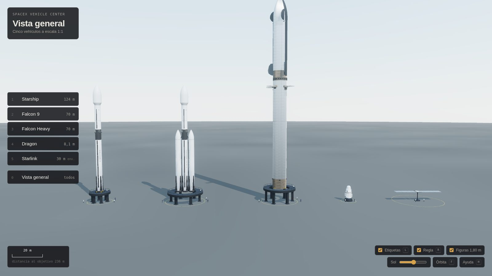

## Ejecutar

Es un sitio estático con módulos ES e *import map*; Three.js r170 (núcleo + los addons usados) va incluido en `vendor/three`, así que no depende de ningún CDN. Sólo necesita un servidor HTTP:

```bash
npx serve .            # o: python3 -m http.server 8080
```

y abrir la URL que indique. Requiere WebGL 2.

## Controles

- **Arrastrar** orbita, **rueda** acerca, **botón derecho** desplaza.
- **F** cambia a vuelo libre: `W A S D` mover, `Q`/`E` bajar/subir, arrastrar para mirar, `Shift` ×4, `Ctrl` ×0,2, rueda ajusta la velocidad.
- **1–5** selecciona vehículo, **0** vista general, **L** etiquetas, **R** regla de altura, **T** pliega la ficha, **H** ayuda.
- Deslizador **Sol** cambia la elevación solar (se recalculan luz, sombras, niebla y mapa de entorno). El azimut está fijado para iluminar los vehículos desde el lado desde el que miran las vistas por defecto.

## Precisión y fuentes

Cada cifra de la ficha técnica lleva su procedencia:

- `spacex.com` — valores publicados en las páginas oficiales de cada vehículo.
- `Wikipedia` — artículo del vehículo, que a su vez cita a SpaceX/NSF (altura de etapas, número de losetas, grid fins de Block 3, dimensiones de la cápsula Dragon…).
- `prensa` — Spaceflight Now / Space.com para el Starlink V2 Mini y el tamaño de loseta.
- `derivado` — calculado a partir de las anteriores.
- **≈** — sin valor público exacto; reconstruido a partir de fotografías. Cada vehículo lista explícitamente estos elementos en *Elementos aproximados*.

### Datos derivados, no inventados

Donde SpaceX no publica una cota, el modelo la deriva de algo que sí está publicado, y lo dice:

- **Estaciones de sección de Starship**: múltiplos enteros del anillo de acero de 1,83 m (faldón 3,5 anillos, base del morro en el anillo 21).
- **Reparto de tanques**: de las masas de propelente publicadas a densidad criogénica — 59 % / 41 % del volumen en Super Heavy, 57 % / 43 % en la nave.
- **Sección de tanques del Falcon 9**: 34,5 m = los 41,2 m de primera etapa menos la interetapa. Los 41,2 m publicados **incluyen** la interetapa; apilarla encima alargaría el propulsor un 16 %.
- **Separación entre núcleos del Falcon Heavy**: 4,25 m, de los 12,2 m de anchura y los 3,7 m de diámetro.
- **Reparto de la Dragon**: 3,7 m de trunk + 4,4 m de cápsula = los 8,1 m declarados; la cápsula se ensancha a 4 m en el hombro del escudo, que es de donde sale el diámetro publicado.

### Discrepancias entre fuentes

El modelo no las oculta:

- Las cifras del Falcon 9 (41,2 + 13,8 + 13,1 = 68,1 m) no suman los 70 m declarados; la diferencia se asigna al adaptador de carga bajo la cofia.
- Los ~18 000 losetas y el tamaño publicado de loseta no son consistentes entre sí; el modelo respeta el tamaño.
- Los ≈30 m de envergadura y los ≈116 m² de superficie del Starlink V2 Mini no son compatibles con un ala de 4,1 m de ancho; el modelo respeta la envergadura y queda un 8 % por debajo en superficie.
- Los 12,2 m del Falcon Heavy se miden entre cilindros; las patas plegadas sobresalen unos 0,3 m.

### Verificación dimensional automática

`src/data/verify.js` mide la caja envolvente real de cada modelo construido y la compara con lo declarado. Se ejecuta con `?verify` en la URL o llamando a `window.__vc.verify()`:

```
vehicle       measure                 declared   built   err%
starship      altura                  124        124        0
starship      envergadura / diámetro  9          9          0
falcon9       altura                  70         70         0
falcon9       envergadura / diámetro  5.2        5.2        0
falconheavy   altura                  70         70         0
falconheavy   envergadura / diámetro  12.2       12.2       0
dragon        altura                  8.1        8.1        0
dragon        envergadura / diámetro  4          4          0
starlink      envergadura             30         30         0
```

## Capturas

| | |
|---|---|
| 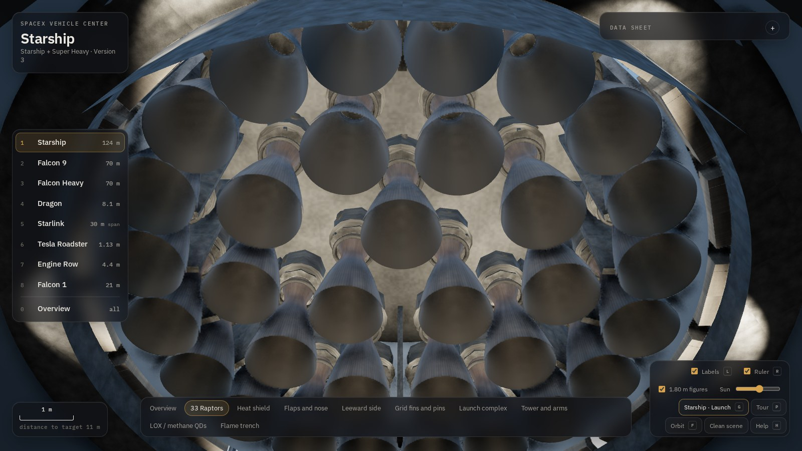 | 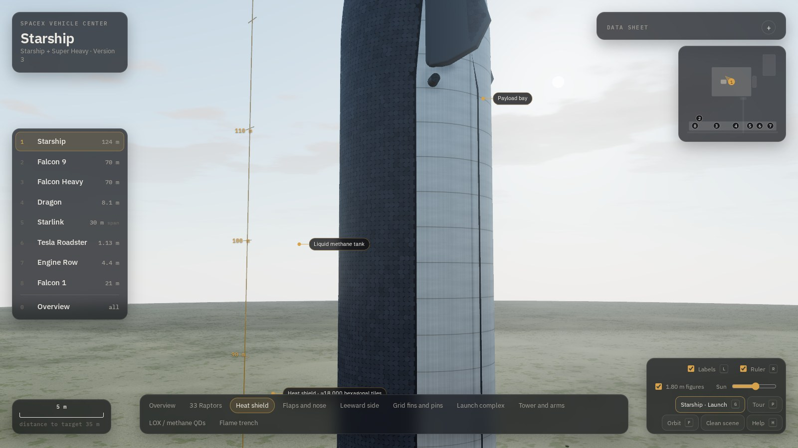 |
| 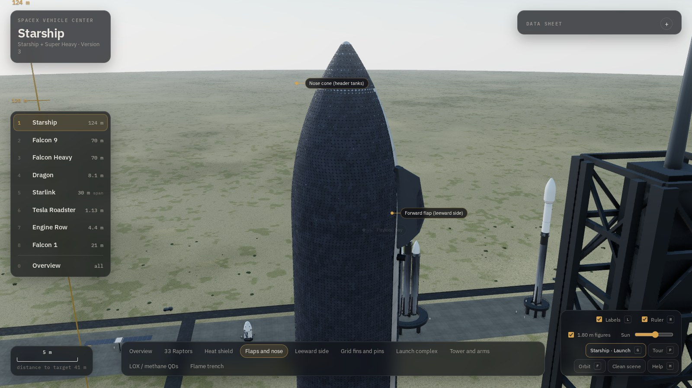 | 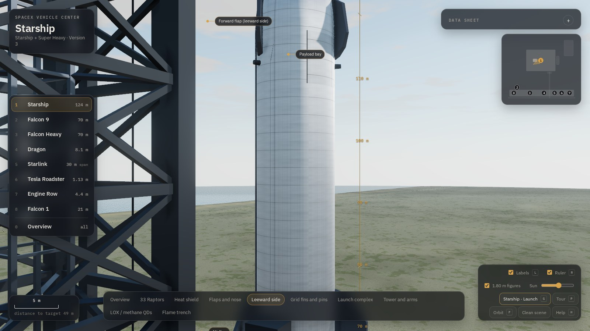 |
| 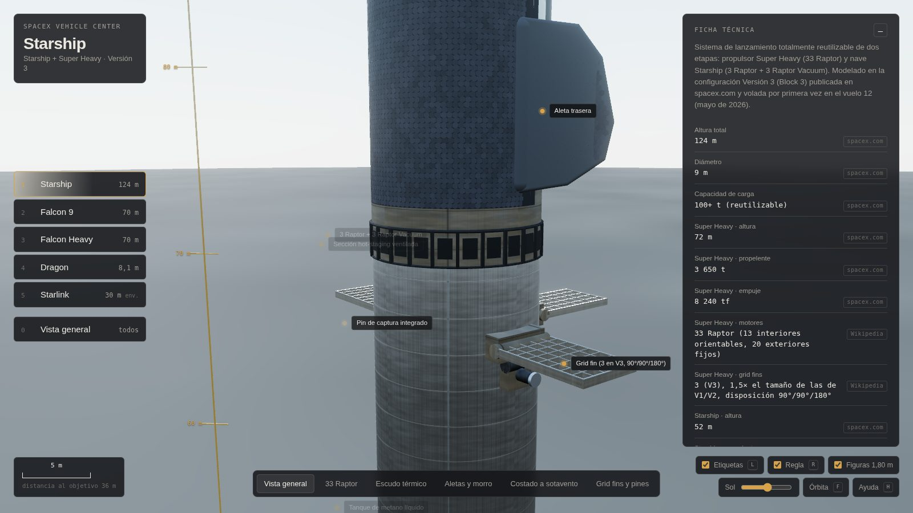 | 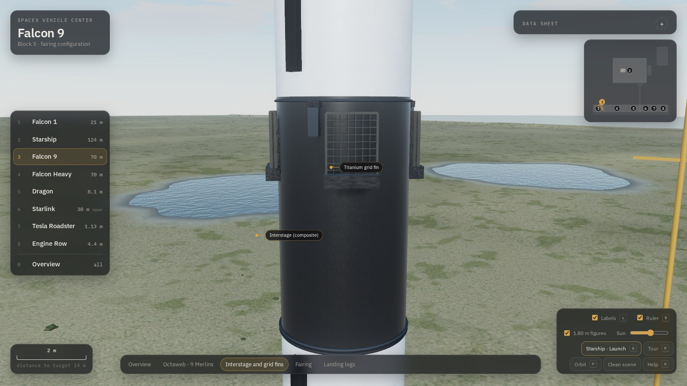 |
| 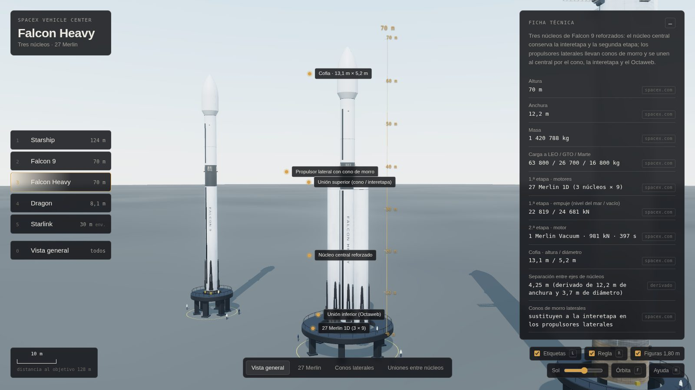 | 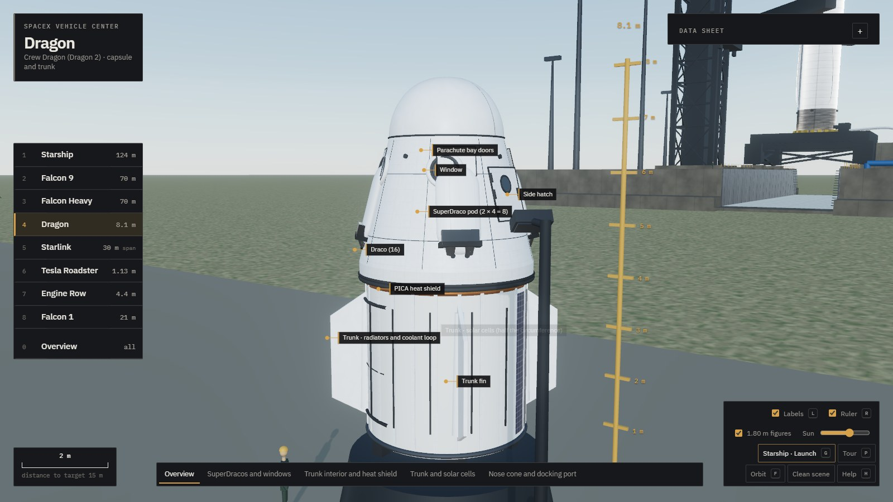 |
| 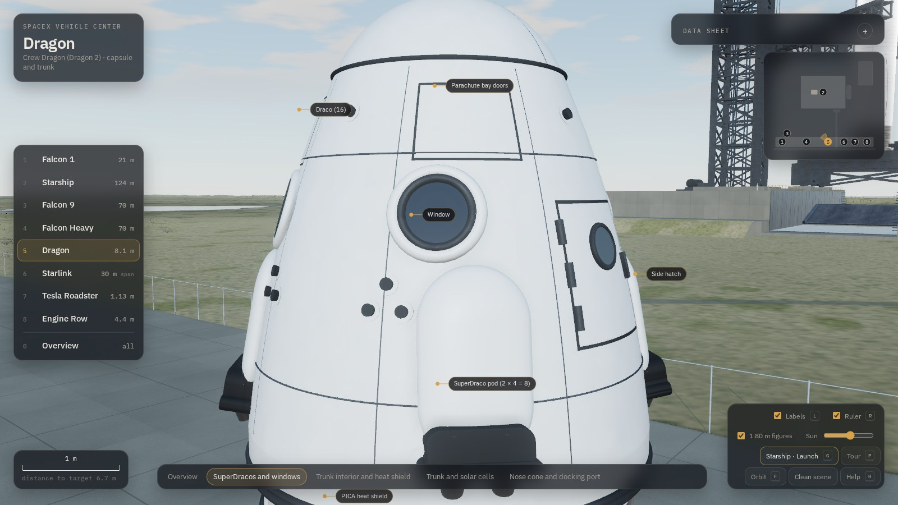 | 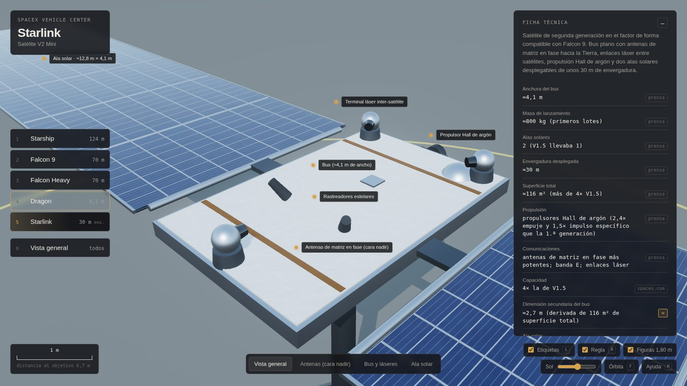 |

## Estructura

```
index.html                 entrada (import map de Three.js)
vendor/three/              Three.js r170 (build + addons usados)
src/main.js                escena, distribución de los vehículos, oclusión de etiquetas, bucle
src/core/environment.js    cielo físico, sol, sombras dinámicas, mapa de entorno PMREM
src/core/cameraRig.js      órbita + vuelo libre + transiciones + límite polar sobre el suelo
src/geometry/utils.js      lathe con normales analíticas, ojivas romas, losetas instanciadas,
                           superficies aerodinámicas lofteadas
src/materials/textures.js  texturas procedurales (Canvas 2D → color / rugosidad / normales)
src/materials/library.js   materiales PBR, compartidos para no duplicar mapas
src/vehicles/*.js          constructores de cada vehículo y motores instanciados
src/data/specs.js          ficha técnica con procedencia de cada dato
src/data/verify.js         comprobación de coherencia entre lo declarado y lo construido
src/ui/hud.js              interfaz
```

## Presupuesto de rendimiento

Medido en la vista general con los cinco vehículos cargados:

| | |
|---|---|
| Triángulos en vista general | ≈474 000 (escudo en su nivel de detalle lejano) |
| Triángulos de cerca | ≈830 000 (de los cuales ≈365 000 son las losetas instanciadas) |
| Memoria de texturas | ≈81 MB en 37 mapas |
| Generación de materiales | ≈2,8 s en el arranque |
| Losetas instanciadas | 13 025 en 1 draw call |

Las losetas usan un prisma hexagonal de 28 triángulos sin cara trasera (nunca visible, siempre apoyada en el casco) y un chaflán superior que da el brillo del borde.

**Nivel de detalle del escudo térmico.** Trece mil hexágonos de 0,26 m se convierten en ruido sub-píxel en cuanto el vehículo está a más de unas decenas de metros: el escudo deja de leerse como una superficie y pasa a ser una mancha moteada de borde deshilachado. A partir de unos 90 m (cuando una loseta baja de ~3,5 px) las instancias se sustituyen por una superficie de revolución con el mismo mosaico horneado en textura, que cubre exactamente la misma ventana angular. De cerca se ve la geometría real; de lejos, un panel limpio con el borde nítido — y 373 000 triángulos menos.

## Despliegue

El flujo de GitHub Actions en `.github/workflows/pages.yml` publica el sitio en GitHub Pages.
