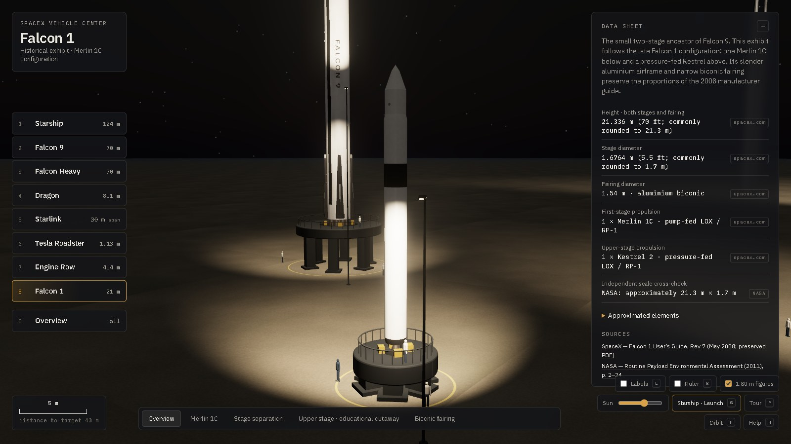
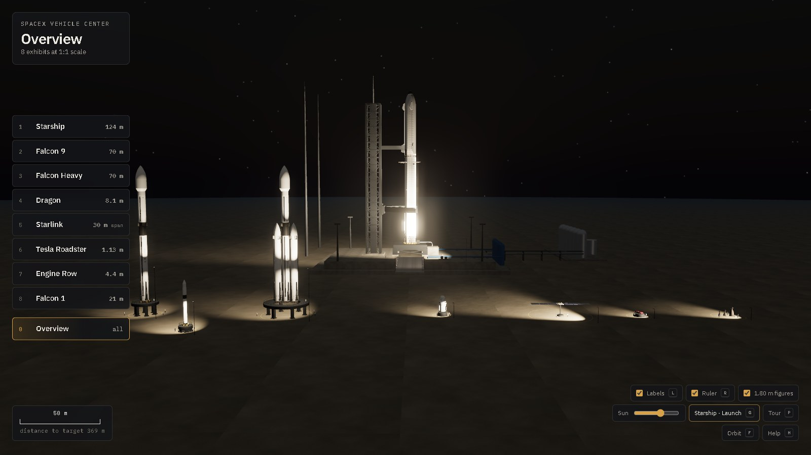

# SpaceX Vehicle Center

Experiencia 3D interactiva, a escala real (1 unidad = 1 metro), con recreaciones técnicas de ocho expositores de SpaceX:

| Vehículo | Configuración modelada | Altura / envergadura |
|---|---|---|
| Starship + Super Heavy | Versión 3 (Block 3): 33 Raptor 3, 3 grid fins con pines de captura integrados, sección hot-staging ventilada | 124 m |
| Falcon 9 | Block 5 con cofia de 5,2 m, patas plegadas, grid fins de titanio | 70 m |
| Falcon Heavy | Tres núcleos, propulsores laterales con cono de morro | 70 m · 12,2 m de ancho |
| Dragon | Crew Dragon con trunk (paneles solares en media circunferencia, radiadores, aletas) | 8,1 m |
| Starlink | V2 Mini con las dos alas solares desplegadas | 30 m de envergadura |
| Tesla Roadster | 1.ª generación (modelo 2010, carrocería anterior al 2.5) con Starman, carga útil del vuelo inaugural del Falcon Heavy | 3,947 m · 1,852 m de ancho · 1,128 m de alto |
| Engine Row | Raptor 3, Raptor Vacuum y Merlin 1D sobre cunas, a 1:1 | 4,4 m (RVac) |
| Falcon 1 | Configuración tardía de 2008: Merlin 1C, Kestrel y cofia bicónica; corte educativo de la segunda etapa | 21,336 m · 1,6764 m de diámetro |

Starship no está sobre un soporte de museo sino sobre su plataforma: una reconstrucción a escala del **Pad 2 de Starbase** — la explanada, la zanja de llamas bidireccional revestida de inoxidable con su deflector central, la mesa de lanzamiento cuadrada de cubierta refrigerada por agua con sus veinte pinzas de sujeción, las conexiones separadas de metano y oxígeno del propulsor con su búnker dividido, la torre de integración de 144,5 m, los brazos de captura de 36 m, el brazo de desconexión rápida de la nave, los pararrayos y la granja criogénica. Desde ahí **despega**: con **G** o el botón *Launch* corre la secuencia completa, de la cuenta atrás a la separación en caliente — y después **el propulsor vuelve y la torre lo atrapa**, con el ciclo de boostback, el descenso, el encendido de aterrizaje y los brazos cerrándose sobre él.

Todo el modelo es procedural (sin binarios): las geometrías se generan a partir de perfiles de revolución con normales analíticas y UV métricas, los materiales PBR usan texturas generadas en Canvas (acero laminado con soldadura de anillo cada 1,83 m y costura vertical de placa cada 7,3 m, hollín, composite de carbono, células solares, PICA, hormigón) y el escudo térmico de Starship son ~13 300 losetas hexagonales instanciadas de 0,26 m entre caras sobre la mitad expuesta del casco, el morro y las aletas.

Los acabados están calibrados contra fotografías del vehículo real: el acero inoxidable es **mate**, no espejo, y muestra las dos direcciones de soldadura; las losetas forman un **mosaico de gris carbón con variación en manchas** — no ruido por loseta, que se lee como escamas de pez — y no proyectan sombra sobre sí mismas; y las aletas son **oscuras por ambas caras**, con la de barlovento texturada.


## Ejecutar

Es un sitio estático con módulos ES e *import map*; Three.js r170 (núcleo + los addons usados) va incluido en `vendor/three`, así que no depende de ningún CDN. Sólo necesita un servidor HTTP:

```bash
npx serve .            # o: python3 -m http.server 8080
```

y abrir la URL que indique. Requiere WebGL 2.

## Controles

- **Arrastrar** orbita, **rueda** acerca, **botón derecho** desplaza.
- **F** cambia a vuelo libre: `W A S D` mover, `Q`/`E` bajar/subir, arrastrar para mirar, `Shift` ×4, `Ctrl` ×0,2, rueda ajusta la velocidad.
- **1–8** selecciona expositor, **0** vista general, **L** etiquetas, **R** regla de altura, **T** pliega la ficha, **H** ayuda.
- **P** (o el botón *Tour*) recorre el centro parada por parada; cualquier arrastre, rueda o clic lo termina y devuelve la cámara.
- **G** (o el botón *Lanzamiento*) arranca la secuencia de Starship. Durante la cuenta atrás y el ascenso la cámara sigue un plan de planos, pero **arrastrar o girar la rueda devuelve el control al instante** sin detener la secuencia. El panel de misión lleva reloj, fase, altitud, velocidad, distancia y empuje, un selector de velocidad ×1 / ×2 / ×5 / ×10 que multiplica el reloj (no salta hitos) y un botón para terminar.
- Deslizador **Sol** recorre el día entero, de −10° a 75° de elevación (se recalculan luz, sombras, niebla y mapa de entorno). **Por debajo del horizonte el centro pasa a modo noche**: el cielo pierde su dispersión y aparecen las estrellas, y cada estación enciende un foco cálido sobre su expositor. Esa iluminación es escenografía del centro y está marcada como tal en la ficha. El azimut está fijado para iluminar los vehículos desde el lado desde el que miran las vistas por defecto.

## Precisión y fuentes

Cada cifra de la ficha técnica lleva su procedencia:

- `spacex.com` — valores publicados en las páginas oficiales de cada vehículo.
- `Wikipedia` — artículo del vehículo, que a su vez cita a SpaceX/NSF (altura de etapas, número de losetas, grid fins de Block 3, dimensiones de la cápsula Dragon…).
- `prensa` — Spaceflight Now / Space.com para el Starlink V2 Mini y el tamaño de loseta; NASASpaceflight y Space Explored para el Pad 2.
- `derivado` — calculado a partir de las anteriores.
- **≈** — sin valor público exacto; reconstruido a partir de fotografías. Cada vehículo lista explícitamente estos elementos en *Elementos aproximados*.

### Datos derivados, no inventados

Donde SpaceX no publica una cota, el modelo la deriva de algo que sí está publicado, y lo dice:

- **Estaciones de sección de Starship**: múltiplos enteros del anillo de acero de 1,83 m (faldón 3,5 anillos, base del morro en el anillo 21).
- **Reparto de tanques**: de las masas de propelente publicadas a densidad criogénica — 59 % / 41 % del volumen en Super Heavy, 57 % / 43 % en la nave.
- **Sección de tanques del Falcon 9**: 34,5 m = los 41,2 m de primera etapa menos la interetapa. Los 41,2 m publicados **incluyen** la interetapa; apilarla encima alargaría el propulsor un 16 %.
- **Separación entre núcleos del Falcon Heavy**: 4,25 m, de los 12,2 m de anchura y los 3,7 m de diámetro.
- **Reparto de la Dragon**: 3,7 m de trunk + 4,4 m de cápsula = los 8,1 m declarados; la cápsula se ensancha a 4 m en el hombro del escudo, que es de donde sale el diámetro publicado.

### Discrepancias entre fuentes

El modelo no las oculta:

- Las cifras del Falcon 9 (41,2 + 13,8 + 13,1 = 68,1 m) no suman los 70 m declarados; la diferencia se asigna al adaptador de carga bajo la cofia.
- Los ~18 000 losetas y el tamaño publicado de loseta no son consistentes entre sí; el modelo respeta el tamaño.
- Los ≈30 m de envergadura y los ≈116 m² de superficie del Starlink V2 Mini no son compatibles con un ala de 4,1 m de ancho; el modelo respeta la envergadura y queda un 8 % por debajo en superficie.
- Los 12,2 m del Falcon Heavy se miden entre cilindros; las patas plegadas sobresalen unos 0,3 m.

### El complejo de lanzamiento y la secuencia

SpaceX **no publica ninguna dimensión** de su infraestructura de tierra, así que el pad se construye con lo que sí es citable y se reconstruye el resto explícitamente:

| | |
|---|---|
| Citado | torre de 144,5 m (474 ft) · brazos de 36 m · 20 pinzas de sujeción · mesa cuadrada con cubierta refrigerada por agua · zanja de llamas bidireccional de hormigón revestida de inoxidable, con el propulsor varios metros más bajo que en el Pad A |
| Reconstruido (**≈**) | toda dimensión en planta, las cotas de la explanada y de la cubierta, la sección de la celosía, la distancia de la torre al eje, la granja de tanques y los pararrayos |

La escala de lo reconstruido sale de la única referencia dura que hay en cualquier fotografía del pad: los **9 m de diámetro del propulsor**.

La secuencia sigue la misma disciplina. Los **hitos son los publicados** para el vuelo — despegue T+00:00:02, Max-Q T+01:02, MECO T+02:32, separación en caliente T+02:40 — y hay exactamente **tres entradas de autor** entre ellos: la velocidad en la separación, una curva de velocidad y un giro gravitatorio (72° desde la vertical, τ = 64 s). Los ≈ 5 700 km/h de la separación **no son una cifra publicada**: son el ancla a la que se construye la curva, así marcados en la ficha (`derived`, aproximado) y así documentados en `launch.js`. Ninguna retransmisión ni cronología pública da esa velocidad para este vuelo. **La altitud, la distancia recorrida y la actitud del vehículo se integran de esas dos**, no se declaran aparte; por eso el número del panel, la altura a la que está el vehículo y el ángulo que sostiene no pueden contradecirse. La integración llega a 55,8 km y 81 km de distancia en la separación.

El **regreso del propulsor** sigue la misma regla, con una diferencia honesta: sus cuatro hitos están citados del vuelo 5 —el primero en el que alguien atrapó un propulsor orbital— (boostback T+02:45 a T+03:41, encendido de aterrizaje T+06:30, captura T+06:54), pero **la trayectoria entre ellos es de autor, no integrada**: ninguna fuente pública da la altitud de Super Heavy segundo a segundo. Está anclada a esos cuatro tiempos y a un apogeo de ≈96 km, y así está marcada en la ficha. La velocidad del panel sí se **deriva de la propia trayectoria**, para que el número y lo que se ve no puedan contradecirse.

El penacho se calcula a partir de la presión ambiente, no de un guion: corto, estrecho y con tren de diamantes de choque en la plataforma; ancho y acampanado cuando ya no hay aire contra el que empujar.

### Verificación automática

`src/data/verify.js` hace dos pasadas independientes, disponibles con `?verify` en la URL o llamando a `window.__vc.verify()`:

**1. Dimensional** — mide la caja envolvente real de cada modelo construido, en su propio sistema de referencia, y la compara con lo declarado:

```
vehicle       measure                 declared   built   err%
starship      altura                  124        124        0
starship      envergadura / diámetro  9          9          0
falcon9       altura                  70         70         0
falcon9       envergadura / diámetro  5.2        5.2        0
falconheavy   altura                  70         70         0
falconheavy   envergadura / diámetro  12.2       12.2       0
dragon        altura                  8.1        8.1        0
dragon        envergadura / diámetro  4          4          0
starlink      envergadura             30         30         0
```

**2. Complejo de lanzamiento** — `verifyPad()` mide la geometría construida del pad contra las cifras declaradas (altura de torre, longitud de brazo, cotas de cubierta y explanada, profundidad de la zanja, número de pinzas) y marca cada fila como *prensa* o *reconstruido*. Detectó la losa de la cubierta extruida hacia arriba desde su cota, que había enterrado los 2,4 m inferiores del vehículo dentro de ella.

**2b. Interfaces** — `verifyInterfaces()` mide **dónde dos subsistemas construidos por separado tienen que encajar**, que es donde han vivido los errores caros de este proyecto: cada cifra era defendible por su cuenta y estaba mal contra su vecina. Las campanas de los motores tienen que pasar por el agujero de la mesa (la garganta se cortaba 43 cm dentro de veinte de ellas), las pinzas tienen que llegar al faldón (cerraban a 6 cm de él, y su pie entraba 8 cm por dentro), el propulsor tiene que apoyarse en la cubierta, y los brazos de la torre tienen que cerrarse **a la altura de los pines** (lo hacían 6,8 m por debajo, alrededor del tanque de metano). Todo se mide sobre la geometría construida, nunca recalculando la constante que la produjo.

**3. Integridad de la escena** — recorre todas las mallas y detecta los modos de fallo que realmente han ocurrido en este proyecto: material que muestrea una textura sobre una geometría **sin atributo `uv`** (Three.js deriva las tangentes de las derivadas de `vUv`, así que un `vUv` constante las degenera y la superficie sale negra o reventada), UVs que existen pero son **constantes** (`mergeAll` fabrica un atributo a ceros para que `mergeGeometries` no reviente, que es el mismo fallo disfrazado), UVs **a la escala equivocada**, geometría sin normales, vértices no finitos y **transformadas no finitas**.

La escala de UVs merece su propia nota. El proyecto tiene dos convenciones: UVs en metros contra mapas que fijan `repeat = 1/tileSize`, y UVs normalizadas contra mapas que envuelven una sola vez. Mezclarlas es invisible en el código y ruinoso en pantalla. `toTexture` guarda el tamaño de teselado para el que se creó cada mapa, así que la comprobación no pregunta *¿varían estas UVs?* sino *¿varían al ritmo que esta textura espera?*. Fue lo que dejó cinco kilómetros de explanada con una sola repetición de una textura de 48 m — un téxel cada veinte metros, y el suelo gris liso en todas las vistas generales.

Todas están auto-testeadas: romper cada cosa a propósito hace saltar su comprobación con un diagnóstico útil, y repararla la devuelve a cero.

### Puerta de validación en CI

`npm run check` ejecuta primero las regresiones deterministas de nube, trayectoria y hardware, después levanta el sitio en Chromium headless, recorre las 46 vistas autoradas y termina con cinco tamaños responsive a DPR 2. Comprueba que la cámara es finita, la geometría conserva sus interfaces, el HUD no se solapa, el diálogo modal bloquea los atajos del fondo y la consola queda limpia. La escena principal se carga con `?quality=high` y **se comprueba**: el rasterizador por software sobre el que corre CI caería en el nivel más barato, y la puerta estaría midiendo una escena reducida sin enterarse, porque una escena reducida es coherente consigo misma. Los checks sin navegador requieren Node 22.15 o posterior para cargar Three.js vendorizado sin alterar los imports de producción.

También comprueba las **combinaciones**, que es donde han estado los errores: del lanzamiento al vuelo libre, de la vista orbital al lanzamiento y de vuelta, noche + vuelo completo + reset devolviendo la misma atmósfera, redimensionar en mitad de una transición, veinte cambios de vista seguidos dejando un estado coherente, y el detalle retirándose con la distancia y volviendo al acercarse. Y las invariantes de la máquina de estados directamente: que una vista inexistente cae en la primera del expositor, que la vista orbital se *deduce* en vez de fijarse, y que el dueño de la cámara pasa limpiamente de visita a lanzamiento a visitante.

Cierra con un **presupuesto de escena** que informa en vez de bloquear: triángulos construidos y dibujados, mallas, materiales y texturas. Sus techos están muy por encima de las cifras de hoy, así que detecta que algo se ha duplicado — algo construido dentro de un bucle — sin tumbar una compilación por ruido entre máquinas.

También **recorre la secuencia de lanzamiento**. `launch.seek(t)` reproduce el estado completo de un instante de misión — nube de tierra incluida, resimulada desde la ignición a paso fijo — en vez de limitarse a avanzar, y eso es lo que la hace comprobable: el gate visita diecisiete hitos exigiendo transformadas finitas y cámara sobre la explanada, comprueba que el perfil de ascenso nunca retrocede (hasta la separación: después el panel sigue al propulsor, que baja a propósito), comprueba que **el propulsor sube, vuelve al eje de la torre y los brazos se cierran sobre él**, y comprueba que guardar la secuencia deja la escena **exactamente** como estaba (vehículo, brazo de desconexión, las veinte pinzas, los brazos de captura, planos de cámara y niebla). Sale con código distinto de cero si algo falla, y el flujo de GitHub Actions **bloquea el despliegue** con ella.

## Capturas

| | |
|---|---|
|  |  |
|  |  |
|  |  |
|  |  |
|  |  |
|  |  |
|  |  |
|  |  |
|  |  |
|  |  |
|  |  |
|  |  |
|  |  |
|  |  |
|  |  |
|  |  |
|  |  |
|  |  |

Regenerables con `npm run shots`, que recorre los encuadres declarados en `tools/docs-shots.json` y `tools/launch-shots.json`.

## Estructura

```
index.html                 entrada (import map de Three.js)
vendor/three/              Three.js r170 (build + addons usados)
src/main.js                escena, distribución de los vehículos, oclusión de etiquetas, bucle
src/core/viewState.js      qué está mostrando el centro: dueño de la cámara, expositor, vista,
                           vuelo y mobiliario, como una máquina de estados con transiciones
src/core/lod.js            detalle en función del tamaño en pantalla, para todo el centro
src/core/quality.js        nivel de calidad del dispositivo (píxeles, sombras, post, partículas)
src/core/environment.js    cielo físico, sol, sombras dinámicas, mapa de entorno PMREM
src/core/backdrop.js       fondo orbital (Tierra ilustrativa + estrellas) de la vista del Roadster
src/core/cameraRig.js      órbita + vuelo libre + transiciones + límite polar sobre el suelo
src/geometry/utils.js      lathe con normales analíticas, ojivas romas, losetas instanciadas,
                           superficies aerodinámicas lofteadas
src/materials/textures.js  texturas procedurales (Canvas 2D → color / rugosidad / normales)
src/materials/library.js   materiales PBR, compartidos para no duplicar mapas
src/vehicles/*.js          constructores de cada vehículo y motores instanciados
src/vehicles/pad.js        complejo de lanzamiento (Pad 2 de Starbase) a escala
src/sim/launch.js          secuencia de lanzamiento: perfil integrado, planos y hardware
src/sim/plume.js           penacho gobernado por la presión ambiente y nube de tierra
src/data/specs.js          ficha técnica con procedencia de cada dato
src/data/verify.js         comprobación de coherencia entre lo declarado y lo construido
src/ui/hud.js              interfaz
```

## Presupuesto de rendimiento

Medido con `npm run profile`, que informa del reparto del arranque, triángulos, draw calls, materiales, texturas y tiempo de fotograma en la vista general, en un primer plano y durante el lanzamiento. La puerta de CI imprime las cifras de escena en cada ejecución.

| | |
|---|---|
| Triángulos construidos | ≈1 205 000 |
| Triángulos dibujados en la vista general | ≈763 000 |
| Mallas | 866, de las cuales 705 se dibujan en la vista general |
| Materiales / texturas | 87 / 73 · ≈101 MB estimados |
| Generación de materiales | ≈2,7 s en el arranque |
| Losetas instanciadas | 13 274 en 1 draw call |

Las losetas usan un prisma hexagonal de 28 triángulos sin cara trasera (nunca visible, siempre apoyada en el casco) y un chaflán superior que da el brillo del borde.

### Nivel de detalle

`src/core/lod.js` hace una sola pregunta por entrada — *¿cuántos píxeles ocupa ahora mismo el detalle más pequeño que esto dibuja?* — y con la respuesta cambia entre estados que los constructores ya produjeron, o deja de dibujar lo que nadie puede ver. **No simplifica mallas ni construye modelos alternativos**, así que las vistas cercanas quedan exactamente igual.

Cada entrada declara `lodFeature`: el tamaño real, en metros, de la pieza más pequeña que contiene. Así el mismo umbral significa lo mismo en una loseta de 0,26 m, en el marco de una ventana de la Dragon y en la junta de 2 cm de su panel trasero.

- **Escudo térmico.** Trece mil hexágonos de 0,26 m se vuelven ruido sub-píxel a unas decenas de metros. Pasados ~90 m las instancias se sustituyen por una superficie de revolución con el mismo mosaico horneado, cubriendo la misma ventana angular: de cerca se ve la geometría real; de lejos, un panel limpio — y 373 000 triángulos menos.
- **Interior del Roadster y Starman.** 247 mallas sobre un coche de 3,9 m que en la vista general mide ocho píxeles. Los asientos cosidos, el Hot Wheels del salpicadero y la placa de circuito dejan de dibujarse; la carrocería, las ruedas y el cristal no, porque son la silueta.
- **Filigrana de la Dragon.** Juntas de panel, marcos, bisagras y tornillería, separadas en dos lotes porque un marco de ventana de 26 cm se lee mucho más lejos que un tornillo de 1,4 cm.

Medido en la vista general contra la misma escena con todo forzado a su estado detallado: **705 mallas y 763 000 triángulos, frente a 787 y 1 157 000**.

### Niveles de calidad

`src/core/quality.js` elige uno de tres niveles al arrancar, a partir de lo que la máquina declara —no de su *user-agent*— y fija con él la densidad de píxeles, la resolución del mapa de sombras, el bloom, el MSAA, el umbral de detalle y el número de partículas de la nube. **El nivel cambia el coste, nunca la corrección**: los vehículos se siguen construyendo a 1:1 desde las mismas cifras y la verificación mide lo mismo. `?quality=low|medium|high` fuerza uno, que es como se prueba un nivel que no tienes — y cómo la puerta de CI se asegura de estar midiendo la escena completa, ya que el rasterizador por software sobre el que corre caería si no en el nivel más bajo.

## Despliegue

El flujo de GitHub Actions en `.github/workflows/pages.yml` publica el sitio en GitHub Pages.
